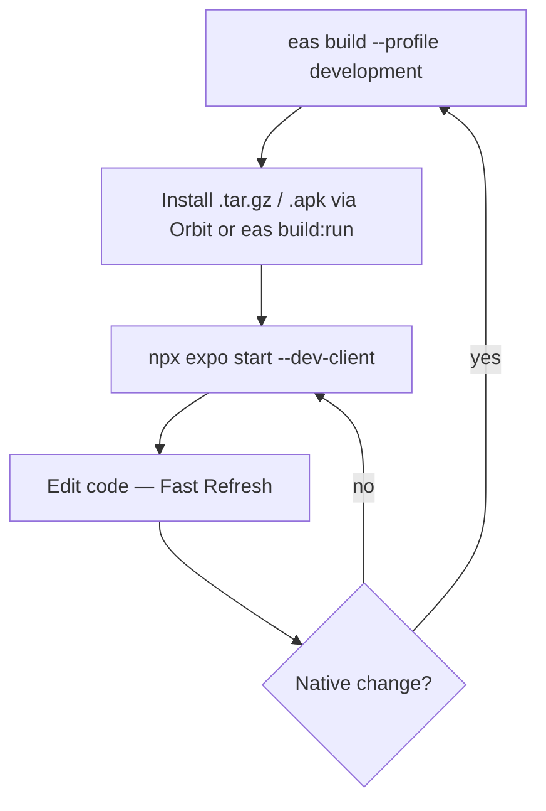
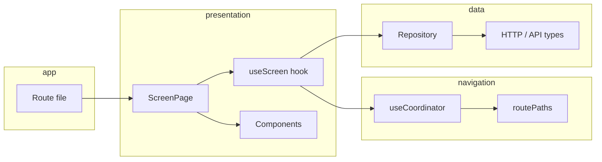

# Recap

React Native app (Expo + Expo Router) for event hosts and guests: home feed, event detail, challenges, album, auth, and more.

## Resources

| Resource | Link |
|----------|------|
| **API docs** (dev) | [Recap API — Swagger](https://dev.api.recap.sinenvolturas.com/docs/api#/) |
| **Create events / accounts** (dev web) | [Sin Envolturas](https://se-v2-dev.jnq.io/) — hosts create events on the web; the app consumes the same backend |
| **Design (Figma)** | [App — S+N](https://www.figma.com/design/LmOrsBZki157jdB1qsYXMA/App---S-N?node-id=1-2844&p=f&t=20gJ8uk9UKHUm54i-0) |
| **EAS project** | [@sin-envolturas/recap](https://expo.dev/accounts/sin-envolturas/projects/recap) |
| **Expo Orbit** | [expo.dev/orbit](https://expo.dev/orbit) · [docs](https://docs.expo.dev/build/orbit/) |

**iOS bundle ID:** `com.sinenvolturas.recap` · **EAS owner:** `sin-envolturas`

---

## Environments

We use two EAS build profiles only: **`development`** and **`production`** (see `eas.json`).

The app talks to the backend via `EXPO_PUBLIC_API_BASE_URL`. If unset, `container.ts` falls back to the **dev API**.

| Profile | Purpose | Env vars (expo.dev) | How you run the app |
|---------|---------|----------------------|---------------------|
| **development** | Day-to-day coding (camera, secure store, dev client) | `development` | 1) EAS build → install `.tar.gz` / `.apk` on simulator 2) `npx expo start --dev-client` |
| **production** | TestFlight, App Store, Play Store | `production` | Standalone `.ipa` / `.aab` — no Metro |

Configure **EAS Environment variables** on [expo.dev](https://expo.dev): Project → **Environment variables** → `development` and `production`. The development profile sets `"environment": "development"` in `eas.json`.

### Important: plain `expo start` is not enough

This app **does not run fully in Expo Go**. Native modules (`expo-camera`, `expo-secure-store`, dev client, etc.) require a **development build** installed on the simulator or device first.

Typical flow:

1. **Build once** (or again after native/plugin changes): `eas build --profile development --platform ios`
2. **Install** the artifact (iOS Simulator: `.tar.gz` → Orbit or `eas build:run`)
3. **Start Metro for the dev client**: `npx expo start --dev-client` — the installed app loads your JS from the bundler

`npx expo start` without `--dev-client` and without a dev build installed will not give you a working app. `npm start` is the same as `expo start`; use `--dev-client` in daily work.

### Environment variables

Expo inlines `EXPO_PUBLIC_*` at **build time**. After changing them, restart Metro or create a **new** EAS build.

| Variable | Purpose |
|----------|---------|
| `EXPO_PUBLIC_API_BASE_URL` | e.g. `https://dev.api.recap.sinenvolturas.com` for dev |
| `EXPO_PUBLIC_MIXPANEL_TOKEN` | Analytics (optional locally) |

Example `.env` in the project root (not committed if secrets differ per dev):

```bash
EXPO_PUBLIC_API_BASE_URL=https://dev.api.recap.sinenvolturas.com
EXPO_PUBLIC_MIXPANEL_TOKEN=
```

### Scripts

| Command | Description |
|---------|-------------|
| `npm start` | `expo start` — use with **`npx expo start --dev-client`** after a dev build is installed |
| `npm run lint` | ESLint |
| `npm run format` | Prettier (sorted imports) |
| `npm run format:check` | Check formatting |

Imports use the `@/` alias → project root (`tsconfig.json`).

---

## Prerequisites

1. **Node.js** and `npm install` in this repo.
2. **EAS CLI:** `npm install -g eas-cli` (project requires CLI `>= 16.7.0`, see `eas.json`).
3. **Expo account** with access to the **sin-envolturas** organization.
4. **iOS:** macOS, **Xcode** (simulator + signing), Apple Developer membership (team **Sin Envolturas S.A.C.**).
5. **Android (optional):** Android Studio + SDK for emulators and Orbit.
6. **Expo Orbit** (recommended): `brew install expo-orbit` or [GitHub releases](https://github.com/expo/orbit/releases).

```bash
eas login
eas whoami   # confirm you see @sin-envolturas/recap
```

---

## Development (daily workflow)

Profile **`development`**: `expo-dev-client`, internal distribution, **iOS Simulator** build (`"simulator": true`).

### 0. One-time setup

```bash
npm install
eas login
```

### 1. Build on EAS (required before you can run the app)

```bash
# iOS Simulator .app (default in eas.json: development.ios.simulator = true)
eas build --profile development --platform ios

# Android emulator / device
eas build --profile development --platform android
```

**Physical iPhone:** the `development` profile is configured for **simulator only** on iOS. For a device binary, temporarily set `"simulator": false` under `build.development.ios` in `eas.json` (or add a second profile), run `eas build` again, then install via Orbit or the EAS internal distribution URL.

First iOS build: EAS will prompt for Apple credentials (team, certificates, provisioning). Credentials are stored on EAS for later builds.

### 2. Install with Expo Orbit (recommended)

1. Install [Expo Orbit](https://expo.dev/orbit) and open it (menu bar on macOS).
2. In [EAS Builds](https://expo.dev/accounts/sin-envolturas/projects/recap/builds), open the finished **development** build.
3. Click **Open with Orbit** (or drag the `.app` / `.tar.gz` simulator build onto Orbit).
4. In Orbit, **start an iOS Simulator** (or Android emulator) and install the build in one click.

Orbit can also install from a **local file** (`.app` for iOS Simulator, `.apk` for Android).

### 3. Install from CLI (alternative)

```bash
# Lists recent builds and installs to a booted simulator
eas build:run --profile development --platform ios
```

### 4. Start Metro (only after step 2)

The dev build on the simulator is a shell; it needs Metro to load JavaScript:

```bash
npx expo start --dev-client
```

Open the **Recap** dev client already on the simulator (or press `i` if prompted). Fast Refresh applies to TS/TSX changes. **Native** dependency or `app.json` plugin changes → new `eas build` + reinstall.

### Workflow summary



---

## Production — TestFlight & App Store (iOS)

Profile **`production`**: App Store distribution, `autoIncrement` for build numbers (`eas.json`). Submit config points at App Store Connect app **6771149882** (`eas.json` → `submit.production.ios`).

### 1. Production build

```bash
eas build --profile production --platform ios
```

- Uses **production** EAS environment variables (set API and analytics for prod on expo.dev).
- Waits on [build details](https://expo.dev/accounts/sin-envolturas/projects/recap/builds); output is an `.ipa` for App Store Connect.
- Ensure version/build numbers in `app.json` / remote app version policy match release expectations (`appVersionSource: remote` in `eas.json`).

### 2. Submit to TestFlight

```bash
eas submit --platform ios --profile production --latest
```

Or submit a specific artifact:

```bash
eas submit --platform ios --profile production --path /path/to/app.ipa
```

On first submit, EAS uses the Apple ID in `eas.json` (`buildappspe@gmail.com`) and ASC app id **6771149882**. You need App Store Connect API key or Apple ID session access.

### 3. TestFlight testing

1. Open [App Store Connect](https://appstoreconnect.apple.com/) → app **Recap** → **TestFlight**.
2. Wait for processing (often 5–30 minutes).
3. Add **Internal** testers (team) or **External** testers (requires Beta App Review for first external group).
4. Install via TestFlight app on iPhone; verify login (OTP), events, camera challenges, etc. against **production** API env vars.

### 4. App Store release

1. In App Store Connect → **App Store** tab, create a version matching the uploaded build.
2. Fill metadata, screenshots, privacy, export compliance (encryption already declared in `app.json` `ITSAppUsesNonExemptEncryption: false`).
3. Submit for **App Review**; after approval, release manually or by scheduled release.

One-shot build + submit (when credentials are ready):

```bash
eas build --profile production --platform ios --auto-submit
```

### Production Android (Play Store)

```bash
eas build --profile production --platform android
eas submit --platform android --profile production --latest
```

Configure Play Console app id and service account in EAS/Google Play when Android store release is active (`submit.production.android` in `eas.json` is a placeholder).

---

## Production checklist

- [ ] EAS **production** env vars: `EXPO_PUBLIC_API_BASE_URL`, `EXPO_PUBLIC_MIXPANEL_TOKEN`
- [ ] Version acceptable for store (`expo.version` / remote version policy)
- [ ] `eas build --profile production --platform ios` succeeded
- [ ] `eas submit` → build visible in TestFlight
- [ ] Smoke test on device: auth, home feed, event detail, photo/quiz challenges
- [ ] App Store metadata and review submission (iOS)

---


## Project structure

```
app/                    # Expo Router — thin route files only
src/
  core/                 # Cross-cutting: HTTP, API types/paths, DI, analytics
  domain/               # Domain entities (e.g. Event, User)
  features/             # Feature modules (main app code)
  navigation/           # routePaths + useCoordinator
  ui/                   # Shared presentational components & tokens
  i18n/                 # Translations
  assets/               # Images, fonts
```

### `app/` vs `src/`

- **`app/`** — File-based routes. Each file should stay thin: parse `useLocalSearchParams`, then render a `*ScreenPage` from `src/features/...`.
- **`src/`** — All product logic, UI, and data access.

Example route (`app/event/[id]/index.tsx`):

```tsx
// Parse query params → pass props to ScreenPage
export default function EventDetailRoute() {
  const { id, tab, ... } = useLocalSearchParams();
  return <EventDetailScreenPage eventId={...} initialTab={...} />;
}
```

### Feature module layout

Each feature under `src/features/<name>/` is organized by layer:

```
features/<feature>/
  data/              # Repositories, API mappers, local stores, derived helpers
  presentation/
    screens/         # *ScreenPage — layout + composition
    components/      # Feature-specific UI
    hooks/           # Screen orchestration + smaller focused hooks
    context/         # React context when shared across a route subtree
```

Current features: `auth`, `home`, `events` (shared data/repo), `event-detail`, `onboarding`, `profile`.

### Shared layers

| Layer | Role |
|-------|------|
| `src/core/api` | API path constants and response types |
| `src/core/http` | `FetchHttpClient`, auth session, errors |
| `src/core/di/container.ts` | Singleton repositories (`authRepository`, `eventRepository`) |
| `src/domain/entities` | App-facing types decoupled from API shapes |
| `src/ui` | Reusable buttons, modals, colors, typography — import from `@/src/ui` |

Data flow for remote data:

**API response → mapper (`*Map.ts` / `eventDomainMap.ts`) → domain entity → hooks/screens**

Repositories (e.g. `EventRepository`) call HTTP, parse bodies, map to domain, and sometimes merge with local cache (`homeEventCache`).

---

## Design patterns

### 1. Screen hook pattern (orchestration)

**Screens stay mostly presentational.** State, side effects, repository calls, and navigation live in a `use<Screen>Screen` hook (or `use<Feature>` for smaller flows).

Convention:

- Hook name: `useEventDetailScreen`, `useLoginScreen`, `useHomeScreen`, …
- Screen component: `EventDetailScreenPage`, `LoginScreenPage`, …
- Larger screens return **`{ data, handlers }`** so the page destructures what it renders vs what it wires:

```ts
// useEventDetailScreen.ts
export function useEventDetailScreen(params) {
  const { goBack, goToEventMap, ... } = useCoordinator();
  // useState, useEffect, repository calls, sub-hooks...

  return {
    data: { event, isLoading, activeTab, ... },
    handlers: { onBackPress, setActiveTab, onPullRefresh, ... },
  };
}
```

```tsx
// EventDetailScreenPage.tsx
const { data, handlers } = useEventDetailScreen({ eventId, ... });
// JSX uses data.* and handlers.on*
```

**Move into the screen hook when it:**

- Owns `useState` / `useEffect` for that screen
- Calls repositories or analytics
- Composes multiple sub-hooks (`useEventDetailChallenges`, `useHomeFeed`, …)
- Defines `on*` handlers and navigation side effects

**Keep in components when it:**

- Is purely visual (layout, styles, conditional render)
- Maps `data` to child components without new business rules

**Extract a smaller hook when:**

- Logic is reused across screens or is a distinct concern (tabs, album, keyboard, swipe-to-close, upload, etc.)

### 2. Coordinator pattern (navigation)

Do **not** call `router.push` / `replace` / `back` scattered across the app.

- **Route strings** — `src/navigation/routes.ts` → `routePaths` (single source of truth for URLs and query params).
- **Navigation API** — `src/navigation/useCoordinator.ts` → typed methods (`goToEventDetail`, `goToVerifyCode`, `goBack`, …) with analytics tracking.

```ts
const { goToEventDetail, goBack } = useCoordinator();
goToEventDetail(eventId, EventDetailTab.Challenges);
```

Add a new destination by:

1. Adding the path builder to `routePaths`
2. Adding a method on `useCoordinator`
3. Creating the matching file under `app/`

Use `router.replace` vs `push` intentionally in the coordinator (e.g. post-challenge completion replaces the stack).

### 3. Thin routes + fat features

```
app/event/[id]/index.tsx     →  EventDetailScreenPage  →  useEventDetailScreen
         ↑ parse params only         ↑ composition            ↑ logic
```

### 4. Repository + DI

Screens and hooks depend on repositories from `@/src/core/di/container`, not raw `fetch`. Repositories encapsulate endpoints, parsing, and mapping.

### 5. Route-scoped context

When several screens under one event route share loaded event data, use a provider in the layout (e.g. `EventDetailRouteProvider` in `app/event/[id]/_layout.tsx`) and `useEventDetailRoute()` in child hooks/screens. Do not duplicate fetches in every child.

### 6. Presentation vs data

| `data/` | `presentation/` |
|---------|------------------|
| API mapping, caches, pure derived functions | React components, hooks, context |
| No React imports | No direct `fetch`; use repositories |

Example: `eventDetailDerived.ts` holds pure rules (countdown, guest list copy); `useEventDetailScreen` wires them to UI state.

### 7. i18n

User-facing copy goes through `useTranslation()` / `t('key')` in `@/src/i18n`. Avoid hardcoded strings in components when adding UI.

### 8. Analytics

Navigation is tracked inside `useCoordinator`. Screen-specific actions use `analytics` from `@/src/core/analytics`. Route changes are observed via `AnalyticsRouteObserver` in the root layout.

---

## Code style (quick reference)

- **TypeScript** — `strict` mode; prefer explicit types for public hook return shapes (`EventDetailScreenData`, `EventDetailScreenHandlers`).
- **Prettier** — single quotes, trailing commas, 100 print width; imports sorted via `@trivago/prettier-plugin-sort-imports`.
- **Imports** — `@/src/...` for app code; feature-internal imports can be relative (`../../data/...`).
- **Naming** — `*ScreenPage` for full screens; `use*Screen` for orchestration hooks; `on*` for event handlers; `goTo*` for navigation.
- **Handlers** — wrap async work in `useCallback`; pass stable refs to children and `useEffect` deps.
- **UI** — shared primitives from `@/src/ui`; feature-specific pieces under `presentation/components`.
- **Comments** — JSDoc on non-obvious hooks (orchestration, business windows, API wiring); avoid narrating obvious code.

---

## Adding a new screen (checklist)

1. **`routePaths`** — define the URL (and query params if needed).
2. **`useCoordinator`** — add `goToMyScreen(...)`.
3. **`app/...tsx`** — route file: read params, render `MyScreenPage`.
4. **`src/features/.../presentation/screens/MyScreenPage.tsx`** — layout only.
5. **`src/features/.../presentation/hooks/useMyScreen.ts`** — state, handlers, navigation, data loading.
6. **Repository / mapper** — if new API surface, extend `src/core/api` and a repository under `data/`.
7. **i18n** — add translation keys.
8. **Components** — split large JSX into `presentation/components/` as needed.

---

## Mental model



---

## Learn more

- [Expo documentation](https://docs.expo.dev/)
- [Expo Router](https://docs.expo.dev/router/introduction/)
- [Development builds](https://docs.expo.dev/develop/development-builds/introduction/)
- [EAS Build](https://docs.expo.dev/build/introduction/)
- [Expo Orbit](https://docs.expo.dev/build/orbit/)

When in doubt, find a similar existing flow (e.g. quiz challenge or photo challenge under `event-detail`) and mirror its route → screen → hook → repository structure.
